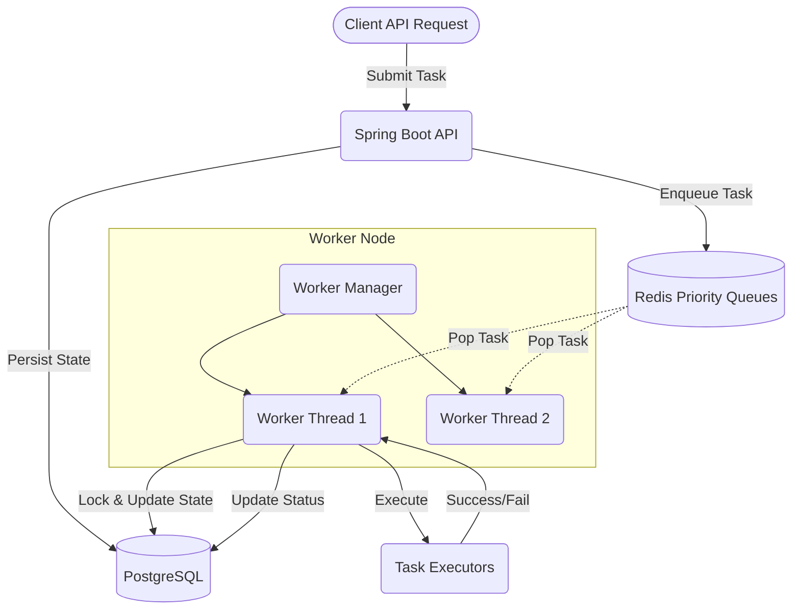

<div align="center">
  <h1>🚀 Distributed Task Queue System</h1>
  <p>A highly reliable, production-grade background job processing system built for scale.</p>
  
  
  
  
  
  
</div>

---

## 📖 Overview

The **Distributed Task Queue (DTQ)** is a highly fault-tolerant, async job processing framework. It is designed to handle background tasks across multiple distributed worker nodes seamlessly. 

By combining the **lightning-fast queueing of Redis** with the **ACID compliance of PostgreSQL**, DTQ ensures that tasks are executed rapidly while guaranteeing that no task is ever lost, even in the event of a total cache failure or node crash.

## ✨ Key Features

- 🚦 **Priority Queues:** Native support for `CRITICAL`, `HIGH`, `NORMAL`, and `LOW` task priorities using Redis Lists.
- 🔁 **Resilient Retries:** Automatic retries for failed tasks featuring exponential backoff and jitter to prevent thundering herds.
- ⚰️ **Dead Letter Queue (DLQ):** Tasks that exhaust their maximum retry limits are safely parked in a DLQ for manual inspection.
- 🔒 **Distributed Locking:** Prevents race conditions and ensures a task is never executed by two worker nodes simultaneously.
- ⏱️ **Task Scheduling:** Schedule tasks to execute in the future.
- ❤️ **Worker Heartbeats:** Workers continuously broadcast their health. If a worker dies mid-execution, the system automatically detects it and re-queues the orphaned tasks.
- 📊 **Real-Time Dashboard:** Beautiful Thymeleaf + Chart.js dashboard for visualizing queue depths, worker status, and task history.
- 🛡️ **API Security:** Built-in sliding-window rate limiting (Redis-backed) to prevent endpoint abuse.
- 📈 **Observability:** Native Prometheus metrics exported via Micrometer, alongside SLF4J MDC structured logging.

---

## 🏗️ Architecture



---

## 🛠️ Technology Stack

- **Core:** Java 17, Spring Boot 3.3.5, Spring Data JPA
- **Storage:** PostgreSQL 16 (Ground-truth state), Redis 7 (Queues, Locks, Rate Limiting)
- **Monitoring & UI:** Thymeleaf, Chart.js, Micrometer, Prometheus
- **Libraries:** Redisson, Lombok, Springdoc OpenAPI (Swagger)

---

## 🚀 Getting Started

### Prerequisites
- [Java 17+](https://adoptium.net/)

### 1. Start Infrastructure
Start the PostgreSQL and Redis containers using the provided docker-compose file:
```bash
docker-compose up -d
```
*(This starts PostgreSQL on port 5432, Redis on 6379, and pgAdmin on 5050)*

### 2. Build the Application
```bash
./mvnw clean package -DskipTests
```

### 3. Run the Server
```bash
java -jar target/distributed-task-queue-1.0.0.jar
```

---

## 📡 API Reference

Swagger UI is available at: `http://localhost:8080/swagger-ui.html`

### Submit a Task
```http
POST /api/tasks
Content-Type: application/json

{
  "taskName": "Generate Monthly Report",
  "taskType": "REPORT_GENERATION",
  "priority": "HIGH",
  "maxRetries": 3,
  "payload": {
    "userId": "usr_9876",
    "format": "pdf"
  }
}
```

### Get Task Status
```http
GET /api/tasks/{taskId}
```

### Schedule a Future Task
```http
POST /api/tasks
Content-Type: application/json

{
  "taskName": "Send Reminder Email",
  "taskType": "EMAIL",
  "scheduledTime": "2026-12-01T10:00:00",
  "payload": { "to": "user@example.com" }
}
```

---

## 🖥️ Web Dashboard

Navigate to `http://localhost:8080/` in your browser to view the real-time operational dashboard. 

The dashboard provides:
- Live aggregate metrics of tasks (Pending, Running, Failed, Completed).
- Queue depth visualization per priority level.
- Live worker node statuses (Idle, Busy, Offline).
- Recent task execution history.

---

## ⚙️ Configuration

Key configurations in `application.yml`:

```yaml
app:
  worker:
    count: 4                  # Number of worker threads per node
    heartbeat-interval: 5000  # Heartbeat ping in ms
    offline-threshold: 30000  # Time before a worker is marked dead
  retry:
    max-retries: 3
    base-delay: 1000          # Exponential backoff base (ms)
    max-delay: 60000          # Exponential backoff max (ms)
```

---

## 🤝 Contributing

Contributions are welcome! Please feel free to submit a Pull Request.
1. Fork the Project
2. Create your Feature Branch (`git checkout -b feature/AmazingFeature`)
3. Commit your Changes (`git commit -m 'Add some AmazingFeature'`)
4. Push to the Branch (`git push origin feature/AmazingFeature`)
5. Open a Pull Request
